# Testing

> Place your test plan, test report and traceability matrix here

## Traceability matrix

### Functional

The table below shows an overview of which test covers which functional requirements

| Test | F1 | F2 | F3 | F4 | F5 | F6 | F7 | F8 | F9 | F10 | 
|:----:|:--:|:--:|:--:|:--:|:--:|:--:|:--:|:--:|:-:|:---:|
|  T1  |    |    |    |    |    |    |    |    | X |     |
|  T2  |    |    |    |    |    |    |    |    |   |  X  |
|  T3  | X  |    | X  |    |    |    | X  |    |   |     |
|  T4  |    |    | X  |    |    |    |    |    |   |     |
|  T5  |    |    |    |    |    |    | X  |    |   |     |
|  T6  |    | X  |    |    |    |    |    |    |   |     |
|  T7  |    |    |    |    | X  | X  |    |    |   |  X  |
|  T8  |    |    |    |    | X  | X  |    |    |   |  X  |
|  T9  |    |    |    |    |    |    |    |    |   |  X  |
| T10  |    |    |    |    |    |    |    |    |   |     |
| T11  |    |    |    |    | X  | X  |    |    | X |     |
| T12  |    |    |    |    |    |    |    | X  |   |     |
| T13  |    |    |    |    |    |    |    | X  |   |     |
| T14  |    |    |    | X  |    |    |    | X  |   |     |

### Non funtional

The table below shows an overview of which test covers which non-functional requirements

| Test | NF1 | NF2 | NF3 | NF4 | NF5 | NF6 | NF7 | NF8 | NF9 | NF10 | NF11 | NF12 | NF13 | NF14 | NF15 | NF16 | NF17 | NF18 | NF19 | 
|:----:|:---:|:---:|:---:|:---:|:---:|:---:|:---:|:---:|:---:|:----:|:----:|:----:|:----:|:----:|:----:|:----:|:----:|:----:|:----:|
|  T1  |  X  |  X  |  X  |  X  |     |     |     |  X  |  X  |  X   |  X   |  X   |  X   |  X   |      |  X   |  X   |  X   |  X   |
|  T2  |  X  |  X  |  X  |  X  |     |     |     |  X  |  X  |  X   |  X   |      |  X   |  X   |      |  X   |  X   |  X   |  X   |
|  T3  |  X  |  X  |  X  |  X  |     |     |     |     |  X  |      |  X   |      |  X   |  X   |      |      |      |      |      |
|  T4  |  X  |  X  |  X  |  X  |     |     |     |  X  |  X  |  X   |  X   |      |  X   |  X   |      |      |      |      |      |
|  T5  |  X  |  X  |  X  |  X  |  X  |     |     |  X  |  X  |  X   |  X   |      |  X   |  X   |      |      |      |      |      |
|  T6  |  X  |  X  |  X  |  X  |     |     |     |  X  |  X  |  X   |  X   |      |  X   |  X   |      |      |      |      |      |
|  T7  |     |  X  |  X  |  X  |     |     |     |  X  |  X  |  X   |  X   |      |  X   |  X   |      |      |      |      |  X   |
|  T8  |     |  X  |  X  |  X  |     |     |     |  X  |  X  |  X   |  X   |      |  X   |  X   |      |      |      |      |  X   |
|  T9  |     |  X  |  X  |  X  |     |     |     |  X  |  X  |  X   |  X   |      |  X   |  X   |      |      |      |      |  X   |
| T10  |  X  |  X  |  X  |  X  |     |     |     |  X  |  X  |  X   |  X   |      |  X   |  X   |      |      |      |      |  X   |
| T11  |     |  X  |  X  |  X  |     |     |     |  X  |  X  |  X   |  X   |      |  X   |  X   |      |      |      |      |  X   |
| T12  |  X  |  X  |  X  |  X  |     |     |     |  X  |  X  |  X   |  X   |      |  X   |  X   |      |      |      |      |      |
| T13  |     |  X  |  X  |  X  |     |     |     |  X  |  X  |  X   |  X   |      |  X   |  X   |      |      |      |      |      |

## Test plan

To ensure the backend is functioning as expected by covering both positive (good) and negative (bad) test cases. This testing will validate that the application provides the best user experience and handles potential issues. 

#### Authorization Requirement

Before running any test cases, users must authenticate to obtain an access token. This is necessary since certain actions are restricted for non-authenticated users or users without admin privileges.

#### Actions

Run auth.http first to authenticate users and retrieve access tokens.
This token will then be used in items.http and bids.http to validate user permissions.

## Test report

Within the traceability matrix, I've included only "good weather" test cases to demonstrate that the backend logic works as expected under ideal conditions. 
However, the actual test files contain both positive (good) and negative (bad) test cases, covering a full range of scenarios to ensure robust backend performance.

### T1: Test for registering a new user
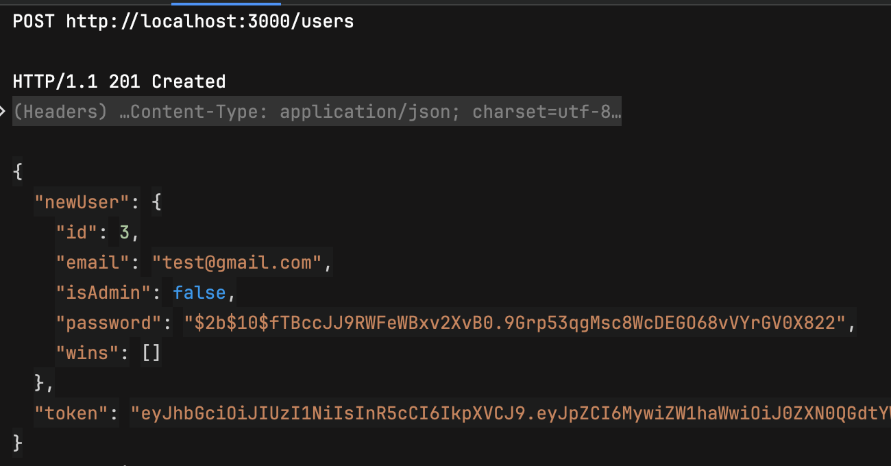

### T2: Test for logging in with the credentials (admin role)
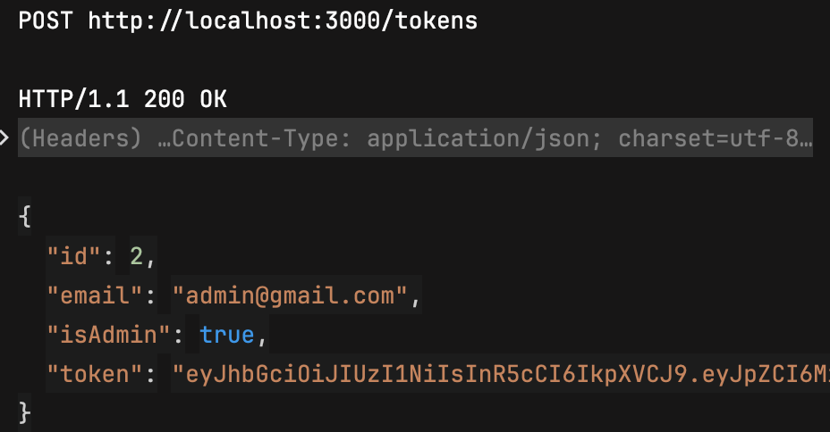

### T3: Test for getting all computers
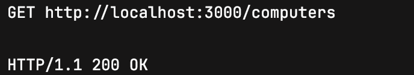

### T4: Test for getting all computers when searhing is set to "apple"
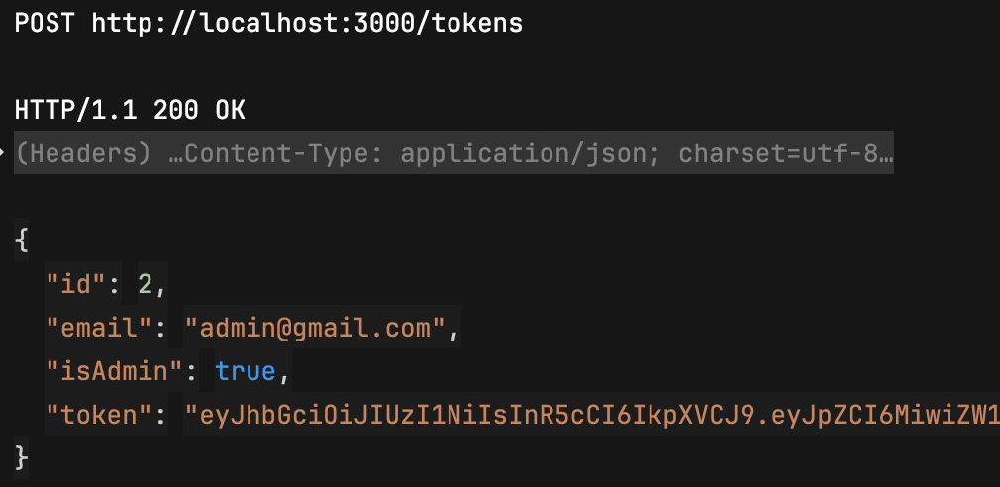

### T5: Test for getting all computers with type "laptop"
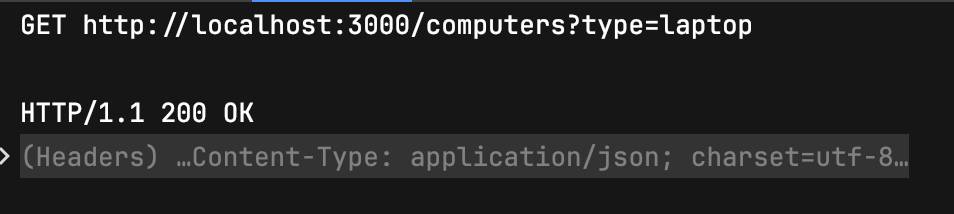

### T6: Test for getting a computer by its ID
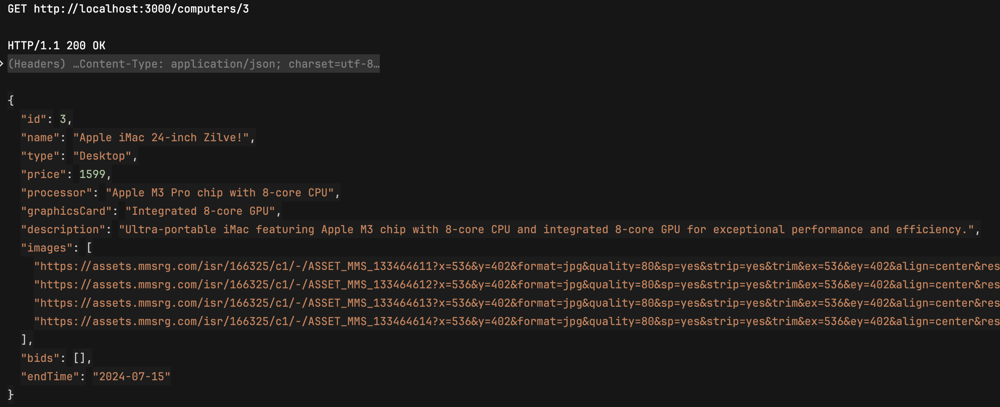

### T7: Test for creating a new computer
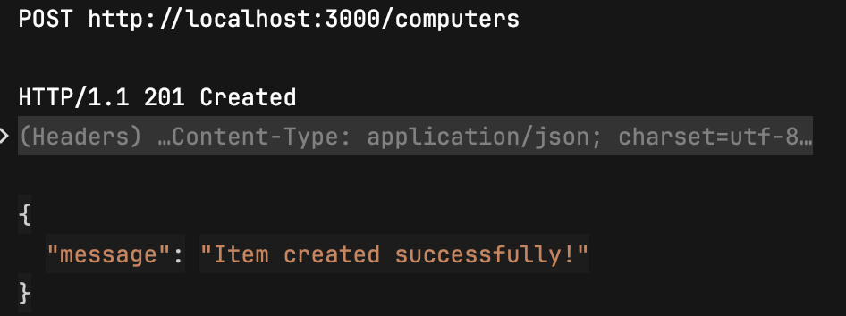

### T8: Test for updating a computer
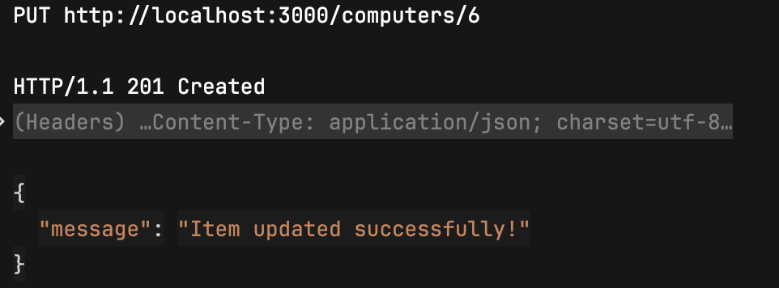

### T9: Test for deleting a computer
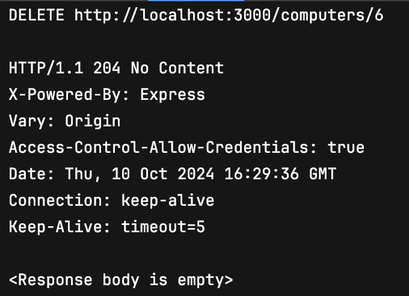

### T10: Test for getting user's wins
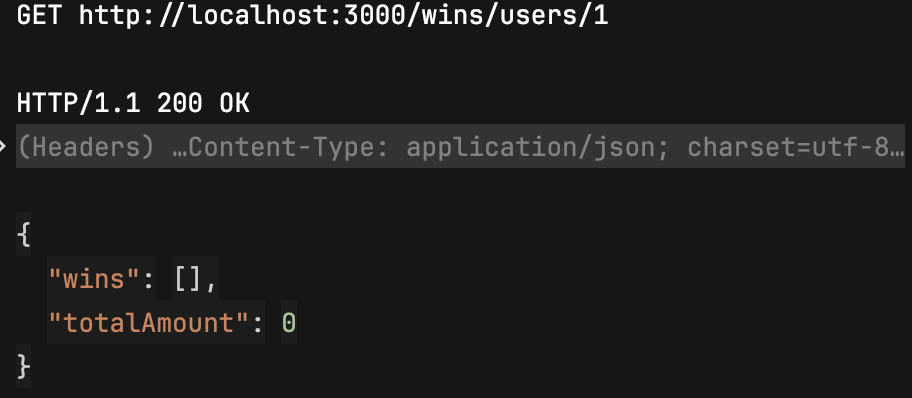

### T11: Test for creating a new bid
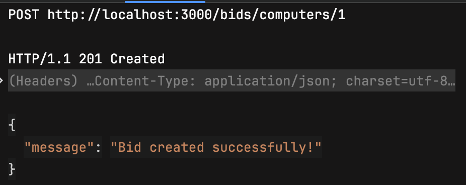

### T12: Test for getting all bids for a certain computer by its id
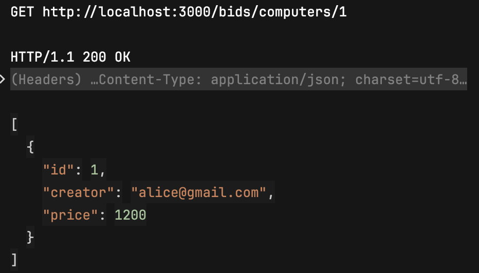

### T13: Test for updating a list of bids in a real-time
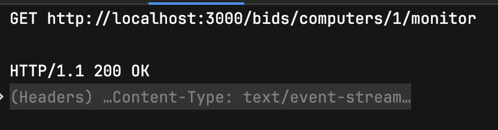

### T14: Test for deleting a bid (forbidden action)
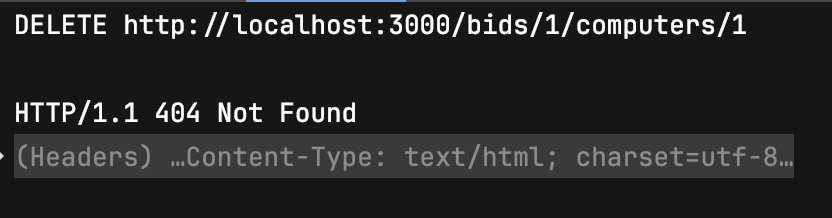